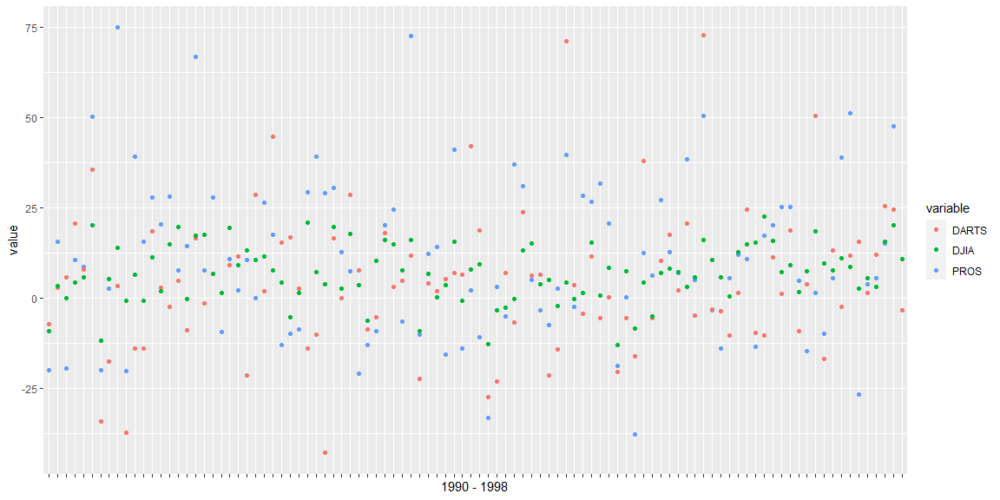

```r
# Use this R-Chunk to import all your datasets!
data<-read_rds("https://github.com/byuistats/data/blob/master/Dart_Expert_Dow_6month_anova/Dart_Expert_Dow_6month_anova.RDS?raw=true") 
```

## Background

_Place Task Background Here_

## Data Wrangling


```r
# Use this R-Chunk to clean & wrangle your data!
view(data)
```

## Data Visualization


```r
# Use this R-Chunk to plot & visualize your data!
ggplot(data = data)+
  geom_point(aes(x = contest_period, y = value, color = variable))+
  labs(x = "1990 - 1998")+
  theme(axis.text.x = element_blank())
```

<!-- -->


```r
# Use this R-Chunk to plot & visualize your data!
newdata<- data%>%
  separate(contest_period, into=c('start_v','end_v'), sep = '-')%>%
  extract(end_v, into=c('end_month', 'end_year'), '(\\D+)(\\d+)', convert=TRUE)%>%
  filter(variable == "DJIA")%>%
  summarise(end_month,end_year,value)
  


pivot_wider(newdata, names_from = end_year, values_from = value)
```

```
## # A tibble: 14 x 10
##    end_month `1990` `1991` `1992` `1993` `1994` `1995` `1996` `1997` `1998`
##    <chr>      <dbl>  <dbl>  <dbl>  <dbl>  <dbl>  <dbl>  <dbl>  <dbl>  <dbl>
##  1 June         2.5   17.7    3.6    7.7   -6.2   16     10.2   16.2   15  
##  2 July        11.5    7.6    4.2    3.7   -5.3   19.6    1.3   20.8    7.1
##  3 August      -2.3    4.4   -0.3    7.3    1.5   15.3    0.6    8.3  -13.1
##  4 September   -9.2    3.4   -0.1    5.2    4.4   14      5.8   20.2  -11.8
##  5 October     -8.5    4.4   -5      5.7    6.9    8.2    7.2    3     NA  
##  6 November   -12.8   -3.3   -2.8    4.9   -0.3   13.1   15.1    3.8   NA  
##  7 December    -9.3    6.6    0.2   NA      3.6    9.3   15.5   -0.7   NA  
##  8 January     NA     -0.8    6.5   -0.8   11.2    1.8   15     19.6   -0.3
##  9 February    NA     11      8.6    2.5    5.5   NA     15.6   20.1   10.7
## 10 March       NA     15.8    7.2    9      1.6    7.3   18.4    9.6    7.6
## 11 April       NA     16.2   10.6    5.8    0.5   12.8   14.8   15.3   22.5
## 12 May         NA     17.3   17.6    6.7    1.3   19.5    9     13.3   10.6
## 13 Dec.        NA     NA     NA      8     NA     NA     NA     NA     NA  
## 14 Febuary     NA     NA     NA     NA     NA      3.2   NA     NA     NA
```

## Conclusions
