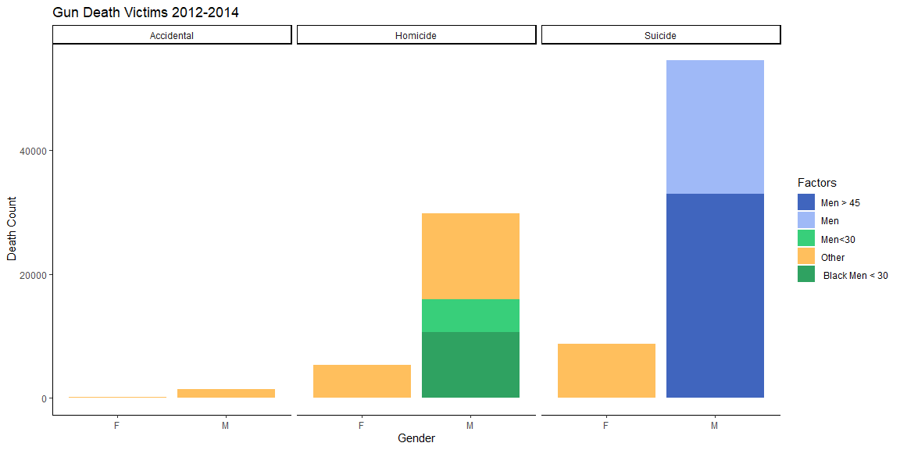
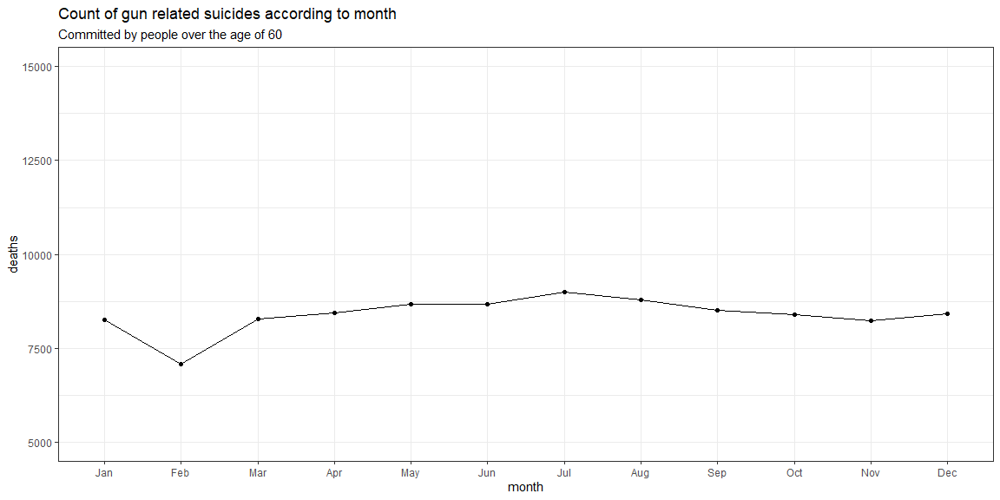
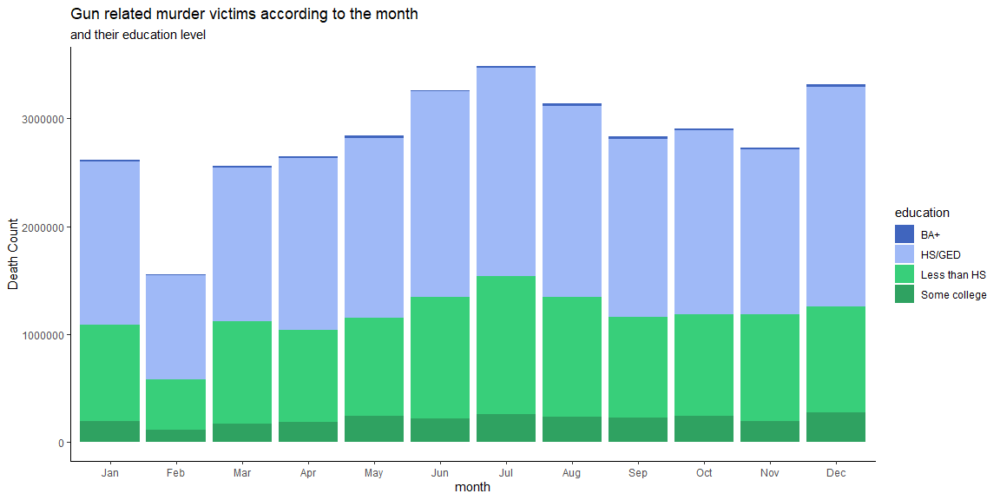
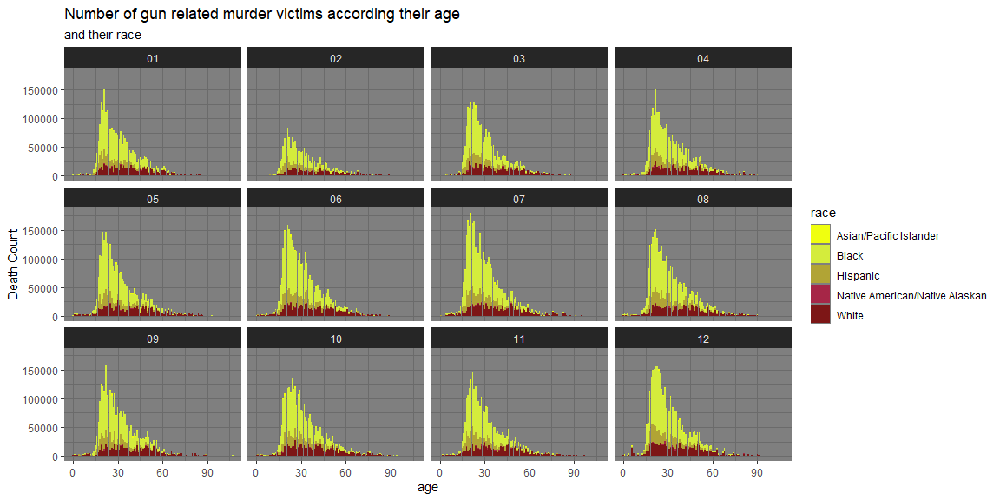

```r
# Use this R-Chunk to import all your datasets!
deaths = read_csv('https://raw.githubusercontent.com/fivethirtyeight/guns-data/master/full_data.csv')
```

## Background

_Place Task Background Here_

## Data Wrangling
the data wrangling is done below

```r
# Use this R-Chunk to clean & wrangle your data!
q1aa <- deaths%>%
  summarise(intent,age,sex,month)%>%
  filter(intent == "Suicide")%>%
  filter(sex == "M")
  
q1ab <- q1aa%>%  
  filter(age > 45)
  #mutate(other = 1 - (sex_perc))

q1ba <- deaths%>%
  summarise(intent,age,sex,race)%>%
  filter(intent == "Homicide")%>%
  filter(sex == "M")%>%
  filter(age < 30)
  
q1bb <- q1ba%>%
  filter(race == "Black")
  #mutate(race_perc = n()/nrow(filter(deaths, intent == "Homicide" & sex == "M" & age<30)))%>%
  

q1c <-deaths%>%
  filter(intent == "Accidental")%>%
  mutate(other = 1)
```


```r
# Use this R-Chunk to clean & wrangle your data!
mlabel <- c("Jan","Feb","Mar","Apr","May","Jun","Jul","Aug","Sep","Oct","Nov","Dec")
q2<-deaths%>%
  group_by(month)%>%
  mutate(avr_dpm = mean(n()))%>%
  filter(intent == "Suicide")%>%
  filter(age > 60)  
```


```r
# Use this R-Chunk to clean & wrangle your data!
q3<-deaths%>%
  filter(intent == "Homicide")%>%
  group_by(month,education)%>%
  mutate(num_ed = n())%>%
  na.omit()
```


```r
# Use this R-Chunk to clean & wrangle your data!
view(q3)
```


```r
# Use this R-Chunk to clean & wrangle your data!
view(deaths)
```

## Data Visualization

## Question 1

Read the FiveThirtyEight article. Create one chart that provides similar insights to the visualization in the   article.


```r
# Use this R-Chunk to plot & visualize your data!

ggplot(data = filter(deaths, intent == "Suicide" | intent == "Homicide" | intent == "Accidental"))+
  geom_bar(aes(x = sex, fill = "#FFBF5D"))+
  geom_bar(data = q1aa,aes( x = sex, fill = '#9FB9F7'))+
  geom_bar(data = q1ab,aes( x = sex, fill = '#4065BE'))+
  geom_bar(data = q1ba,aes( x = sex, fill = '#38CF7A'))+
  geom_bar(data = q1bb,aes( x = sex, fill = '#2FA261'))+
  facet_wrap(~intent)+
  scale_fill_identity(guide = "legend",
                      name = "Factors",
                      breaks = c("#4065BE", "#9FB9F7","#38CF7A","#FFBF5D","#2FA261"),
                      labels = c("Men > 45", "Men","Men<30","Other", " Black Men < 30"),)+
  theme_classic()+
  labs(title = "Gun Death Victims 2012-2014", x = "Gender", y = "Death Count")
```

<!-- -->
  
## Results  
  
for this problem I used bar charts. as they can really demonstrate the difference between the variables.  
from these charts we can conclude that most gun related death victims are men. when we break the data down further  
we see that men older than 45 are more likely to commit suicide.  
  
when we look at people who die of Homicide we see the greatest victims are young men and men who are African   American. this data answers some gun questions in general that can help make sure that firearms are handled  
more responsabily in the future.  
  
## Question 2  
  

```r
ggplot(data = q2)+
  geom_point(aes(x = month, y = avr_dpm))+
  geom_line(aes(x = month, y = avr_dpm, group = intent))+
  scale_y_continuous(limits = c(5000,15000))+
  labs(title = "Count of gun related suicides according to month", subtitle = "Committed by people over the age of 60",y = "deaths", x = "month")+
  scale_x_discrete(labels = mlabel)+
  theme_bw()
```

<!-- -->
  
## Results  
  
A common idea that I have heard is that suicides increase during the winter season, this may make sense logically  
as there is some who suffer from seasonal depression and the general feel around winter time is a little more  
gloomy. this data shows that there is not much of a difference in gun related suicides from those over the age of
60.
  
Because this data set only refers to gun related suicide I am curios if suicide generally speaking differs according to season. Not everyone over the age of 60 is able to purchase a firearm and they may have died from more accessable means.
  
## Question 3
  
  

```r
options(scipen = 999)
ggplot(data = q3)+
  geom_col(aes(x = month, y = num_ed,fill = education))+
  scale_fill_manual(values = c("#4065BE", "#9FB9F7","#38CF7A","#2FA261"))+
  labs(y = "Death Count", 
      title = "Gun related murder victims according to the month",
      subtitle = "and their education level" )+
  scale_x_discrete(labels = mlabel)+
  theme_classic()
```

<!-- -->

  
## Results
  
The next thing I wanted to look at was the effect an education level has on being a murder victim according to the   season. like the suicide rate there was not a significant difference,

I did notice that the death rate was higher in summer months when students would be on break and not as often in   months where people are expected to be in school.
  
it is sad to see that the majority of people who have died only have a high school education. this led me to think that high school children are more likly to die, but then the thought occurred to me that an education does not  necisarily denote the age. and so that led me to.
  
## Question 3  
  


```r
ggplot(data = q3)+
  geom_col(aes(x = age, y = num_ed,fill = race))+
  scale_fill_manual(values = c("#F0FF0F", "#D4EC3C","#B1A435","#A62647","#7D1616"))+
  labs(y = "Death Count", 
      title = "Number of gun related murder victims according their age",
      subtitle = "and their race" )+
  theme_dark() +
  facet_wrap(~month)
```

<!-- -->
  
## Results  
  
I also wanted to see the connection to race, and from what the data shows the murder victims were more likely to be in their early 20s to 30s and not as likely to be high school students. I also wanted to compare the death by
Race, and what the data shows is that a large percentage of gun related murder victims are of African decent.
  
Overall this data demonstrates that it we were to have programs to hinder inappropriate gun use, we would want to target schools during the summer.   

