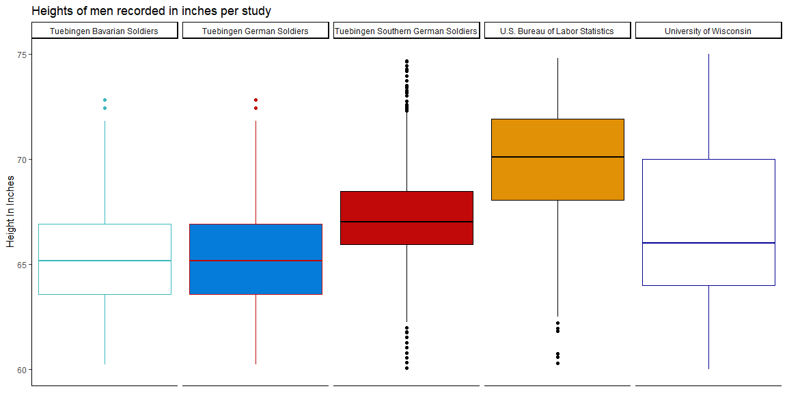
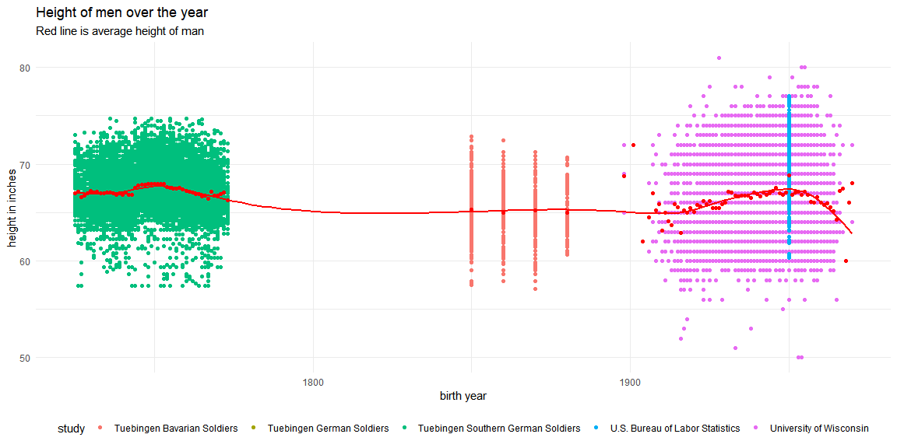

```r
# Use this R-Chunk to import all your datasets!
bavaria19 <-read_dta("https://byuistats.github.io/M335/data/heights/germanconscr.dta")
bavaria191 <-read_dta("https://byuistats.github.io/M335/data/heights/germanprison.dta")

blsmid20 <-read_csv("https://raw.githubusercontent.com/hadley/r4ds/main/data/heights.csv")

uowa19 <-read_sav("http://www.ssc.wisc.edu/nsfh/wave3/NSFH3%20Apr%202005%20release/main05022005.sav")


swsol <- read.dbf(unzip("Heights_south-east.zip"))
```
## Background

The Scientific American argues that humans have been getting taller over the years. As data scientists in training, we would like to use data to validate this hypothesis. This case study will use many different datasets, each with male heights from different years and countries. Our challenge is to combine the datasets and visualize heights across the centuries.

## Data Wrangling


```r
# Use this R-Chunk to clean & wrangle your data!
d1 <- uowa19%>%
  summarise(DOBY,RT216F,RT216I)%>%
  mutate(birth_year = DOBY + 1900)%>%
  filter(RT216I < 12, RT216I >= 0)%>%
  mutate(height.in = (RT216F * 12) + RT216I)%>%
  mutate(height.cm = (height.in * 2.54))%>%
  mutate(study = "University of Wisconsin")%>%
  mutate(century = 20)%>%
  summarise(birth_year,height.in,height.cm,study,century)
```


```r
d2 <- bavaria19%>%
  summarise(bdec,height,age)%>%
  mutate(birth_year = bdec)%>%
  rename("height.cm" = "height")%>%
  mutate(height.in = height.cm * 0.393701)%>%
  mutate(study = "Tuebingen German Soldiers")%>%
  mutate(century = 19)%>%
  summarise(birth_year,height.in,height.cm,study,century)
```


```r
d3 <- bavaria19%>%
  summarise(bdec,height,age)%>%
  mutate(birth_year = bdec )%>%
  rename("height.cm" = "height")%>%
  mutate(height.in = height.cm * 0.393701)%>%
  mutate(study = "Tuebingen Bavarian Soldiers")%>%
  mutate(century = 19)%>%
  summarise(birth_year,height.in,height.cm,study,century)
```


```r
d4 <- blsmid20%>%
  filter(sex == "male")%>%
  mutate(birth_year = 1950)%>%
  rename(height.in = height)%>%
  mutate(height.cm = (height.in * 2.54))%>%
  mutate(study = "U.S. Bureau of Labor Statistics")%>%
  mutate(century = 20)%>%
  summarise(birth_year,height.in,height.cm,study,century)
```


```r
d5 <- swsol%>%
  summarise(GEBJ,CMETER)%>%
  rename(birth_year = GEBJ)%>%
  rename(height.cm = CMETER)%>%
  mutate(height.in = height.cm * 0.393701)%>%
  mutate(study = "Tuebingen Southern German Soldiers")%>%
  mutate(century = 18)%>%
  summarise(birth_year,height.in,height.cm,study,century)
```


```r
bound_data <-bind_rows(d1,d2,d3,d4,d5)
```


```r
bound_data1 <-bound_data%>%
  group_by(birth_year)%>%
  mutate(avg_h_i = mean(height.in))
```


## Data Visualization
   
   
### Plot 1
   

```r
# Use this R-Chunk to plot & visualize your data!
ggplot(data = bound_data)+
  geom_boxplot(aes(y = height.in, fill = study,color = study))+
  scale_y_continuous(limits = c(60,75))+
  facet_wrap(~study, ncol = 5, drop = TRUE)+
  scale_fill_manual(values=c("#FFFFFF","#057BDA","#C10909","#E19106","#FFFFFF" )) +
  scale_color_manual(values=c("#3BB8BC","#C10909","#000000","#000000","#040396" )) +
  theme_classic()+
  theme(legend.position = "hidden",
        axis.text.x = element_blank(),
        axis.ticks.x = element_blank())+
  labs( title = "Heights of men recorded in inches per study",
        y = "Height In Inches")
```

<!-- -->
   
Using this plot we can see that the study with the highest average height in inches is found int the U.S. Labor and   Statistics Data. this is interesting because the LAS data was recorded in the same time period of the University of   Wisconsin but there is a large discrepancy in the mean between the two. this could be for plenty of reasons. the   means by which the people were measured were not recorded, whether it was done on site or that the height was self reported. there are also a difference between heights between people who are of a different ethnicity. Since some studies took that into account and others not it is difficult to make any implications for mens height overall.  
   
    
### Plot 2
  

```r
ggplot(data = bound_data1)+
  geom_point(aes(x = birth_year, y = height.in, color = study))+
  geom_point(aes(x = birth_year, y = avg_h_i),color = "red")+
  geom_smooth(aes(x = birth_year, y = avg_h_i),color = "red")+
  theme_minimal()+
  theme(legend.position = "bottom")+
  labs(title = "Height of men over the year",
       subtitle = "Red line is average height of man",
       y = "height in inches",
       x = "birth year")
```

<!-- -->

in order to answer the question of mens average height increasing over the years, I plotted the height according to   the year the man was born. this red line in the middle measures the mean and what I noticed is how it is not   following a strong trend at any point. this could be for a many reasons. My first thought is that the data is taken at different points of the mans life. a 21 year old may be taller than he would be at 84. another thought is the data is taken from different countries. the average height varies between countries and so the change in size in these  
charts could be directly influenced by these changes. another factor is that we were not provided with all the birthyears, so the average could be skewed within a 10-50 year period
  
  
overall the data is interesting, but it is to diverse to be able to answer the question of height at this time.  
if we had a record that was more controlled, like a record of people in the same country over the years, we might be able to make some solid conclusions.
